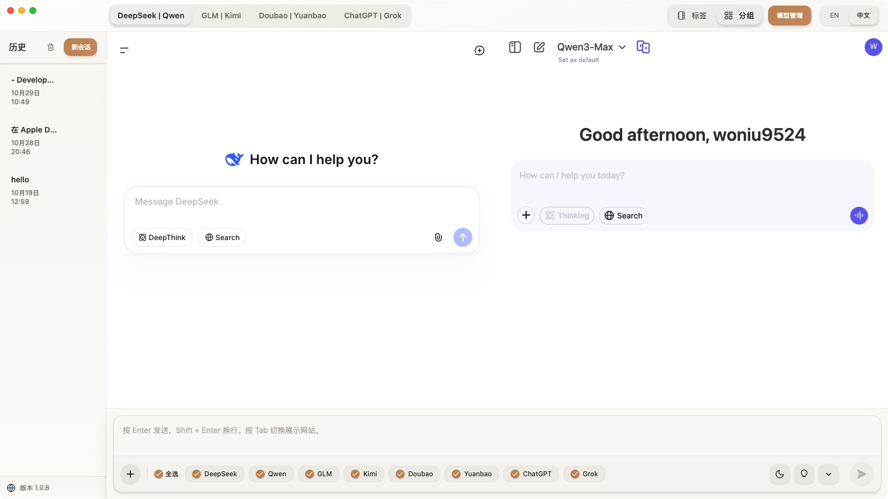
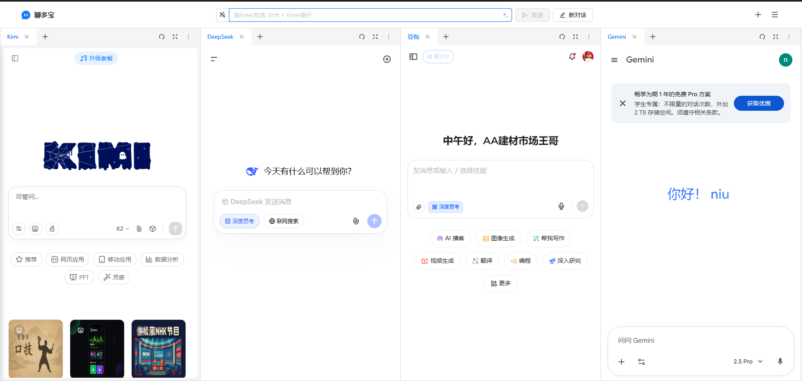

> 出师未捷身先死，记录一次失败的开发经历。

几周前，我在和 AI 对话的时候，有一个需求，就是希望和不同 AI 对话。于是我尝试去搜索了相关工具，搜到的都是基于 API 来实现的。对我来说，我更希望是使用免费的官网。

于是我就尝试自己动手做。

我的第一个反应就是用 Electron 来实现，这也是我最熟悉的技术栈。于是我尝试做了一个 demo，稍有问题，但是可以确认能够实现。

于是开工，编码，完成个七七八八。之后在接入 Gemini 的时候发现了一个致命的问题：无法登录谷歌账户。最后在项目实际使用的时候，还有一个问题容易被认为是异常从而触发风险验证。

此时，我觉得其实问题不大，用起来体验还算尚可。然后我刷知乎刷到一个插件版的，此时我还没意识到问题。

今天发到 Linux.do 的时候有人推荐了同类的插件应用，我点进去看才发现，插件可以解决 Electron 存在的问题。至此项目失败。
## 软件版本（Electron）

## 插件版本（浏览器插件）

### 反思

首先是前期调研，显然不够彻底，没有发现同类工具。而且很莫名其妙的是在完成得差不多的时候被推荐到这个工具。上次做的插件也是，前期调研的时候没搜到类似的工具，做完了刷个手机就刷出来，很神奇。所以下次调研的时候要彻底一点。

第二个大的问题就是技术方案选择错误，我先入为主地选择了 Electron。当然如果没有 Gemini 的问题，其实 Electron 问题也不大，但是相比之下确实不如插件。

另外就是容易触发风控，Electron 容易被检测出来当成爬虫，插件我想在这个方面应该会好很多。

### 总结

总之，项目很失败，只能说当作一次经验教训了。