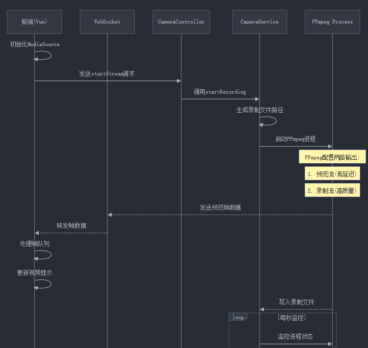

> 最近在做一个小鼠步态分析的项目，需要用高速摄像头记录小白鼠的运动轨迹。本来，直接用前端的 `getUserMedia` ，结果发现事情并没有那么简单...

## 踩坑

一开始直接在前端录制：

```javascript
const stream = await navigator.mediaDevices.getUserMedia({
  video: {
    width: 1280,
    height: 720,
    frameRate: 120
  }
});
```

然后发现：TMD视频有问题，还要用ffmpeg重新编码一遍，还有画质不是很好控制，我查了资料可能达不到120fps录制

## 核心实现思路


整个方案的架构是这样的：
1. Electron作为应用框架
2. FFmpeg负责视频采集和编码
3. WebSocket实现实时预览
4. 同时进行预览流和存储流的处理

FFmpeg的参数设置，我把它分成了两路：
- 一路用于实时预览，追求低延迟
- 另一路用于存储，追求高质量

## 代码实现的关键点

### 1. 启动FFmpeg进程

```javascript
const args = [
  '-f', 'dshow',
  '-video_size', '1280x720',
  '-framerate', '120',
  // 还有超级多参数...
];

const ffmpeg = spawn(ffmpegPath, args);
```

### 2. 视频流分流处理

```bash
-filter_complex "split=2[preview][record]"
```

### 3. 预览流优化

为了实现低延迟预览，我用了一堆"降质但提速"的参数：

```bash
-preset ultrafast
-tune zerolatency
-x264opts "no-scenecut"
```

## 结语

之前希望尽量在electron里处理用的node，最后弄的很乱很麻烦。后面再用的时候就换python吧，之前处理的太差了，尤其是对摄像头资源占用的问题没解决好。
