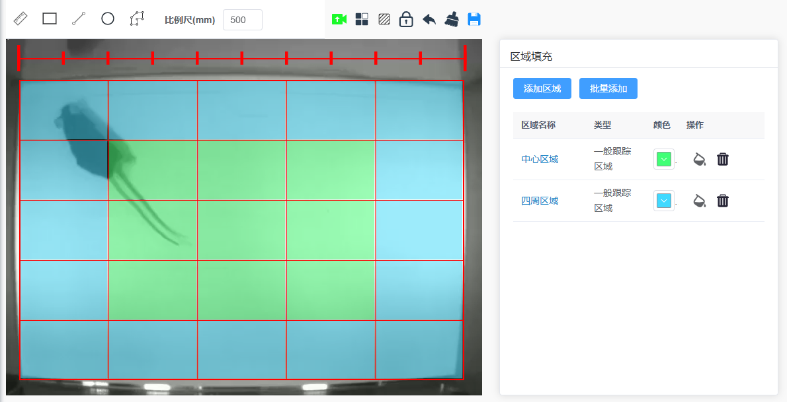

> fabric绘图，分区，区域填充，图形属性获取

### 需求背景

    需要对老鼠行为进行分析，例如老鼠在视频中的哪些区域范围活动。所以需要用fabric在视频上增加一个画布，然后在画布上进行分区。根据老鼠坐标变化来确认当前老鼠在画布中的位置。



### 遇到的一些问题
- fabric应该是不提供填充功能的，我记得之前看issue有人提过，但是作者说不提供这个功能，所以要自己实现。我是先通过洪水填充的办法在画布上用canvas绘制填充区域，然后把它作为图片添加到fabric画布上。
- 解析fabric的时候自定义属性不能被序列化。因为要给填充区域设置标题，还有圆形矩形比例尺啊这些设置名称，我需自定义一些名称。issue里面有解决方案

### 关键的一些代码

> 自定义属性


``` javascript
fabric.Object.prototype.toObject = (function (toObject) {
  return function (propertiesToInclude) {
    return toObject.call(this, ['name', 'title'].concat(propertiesToInclude));
  };
})(fabric.Object.prototype.toObject);
```

> 洪水填充


``` javascript
import { fabric } from 'fabric';

class FloodFillTool {
  constructor(fcanvas, fillColor = '#f00', name = '未定义', fillTolerance = 2) {
    this.fcanvas = fcanvas;
    this.fillColor = fillColor;
    this.fillTolerance = fillTolerance;
    this.name = name;
  }

  static hexToRgb(hex, opacity) {
    opacity = Math.round(opacity * 255) || 255;
    hex = hex.replace('#', '');
    const rgb = [];
    const re = new RegExp('(.{' + hex.length / 3 + '})', 'g');
    hex.match(re).map(function (l) {
      rgb.push(parseInt(hex.length % 2 ? l + l : l, 16));
    });
    return rgb.concat(opacity);
  }

  static withinTolerance(array1, offset, array2, tolerance) {
    let length = array2.length;
    let start = offset + length;
    tolerance = tolerance || 0;

    while (start-- && length--) {
      if (Math.abs(array1[start] - array2[length]) > tolerance) {
        return false;
      }
    }
    return true;
  }

  static fill(imageData, getPointOffsetFn, point, color, target, tolerance, width, height) {
    const directions = [
      [1, 0],
      [0, 1],
      [0, -1],
      [-1, 0]
    ];
    let coords = [];
    let points = [point];
    let seen = {};
    let key, x, y, offset, i, x2, y2;
    let minX = -1,
      maxX = -1,
      minY = -1,
      maxY = -1;

    while (!!(point = points.pop())) {
      x = point.x;
      y = point.y;
      offset = getPointOffsetFn(x, y);

      if (!FloodFillTool.withinTolerance(imageData, offset, target, tolerance)) {
        continue;
      }

      if (x > maxX) {
        maxX = x;
      }
      if (y > maxY) {
        maxY = y;
      }
      if (x < minX || minX == -1) {
        minX = x;
      }
      if (y < minY || minY == -1) {
        minY = y;
      }

      i = directions.length;
      while (i--) {
        if (i < 4) {
          imageData[offset + i] = color[i];
          coords[offset + i] = color[i];
        }

        x2 = x + directions[i][0];
        y2 = y + directions[i][1];
        key = x2 + ',' + y2;

        if (x2 < 0 || y2 < 0 || x2 >= width || y2 >= height || seen[key]) {
          continue;
        }

        points.push({ x: x2, y: y2 });
        seen[key] = true;
      }
    }

    return {
      x: minX,
      y: minY,
      width: maxX - minX,
      height: maxY - minY,
      coords: coords
    };
  }

  enableFloodFill(enable) {
    if (!enable) {
      this.fcanvas.off('mouse:down');
      this.fcanvas.selection = true;
      this.fcanvas.forEachObject((object) => {
        object.selectable = true;
      });
      return;
    }

    this.fcanvas.discardActiveObject().renderAll();
    this.fcanvas.selection = false;
    this.fcanvas.forEachObject((object) => {
      object.selectable = false;
    });

    this.fcanvas.on({
      'mouse:down': (e) => {
        const mouse = this.fcanvas.getPointer(e.e);
        const mouseX = Math.round(mouse.x),
          mouseY = Math.round(mouse.y);
        const canvas = this.fcanvas.lowerCanvasEl;
        const context = canvas.getContext('2d');
        const parsedColor = FloodFillTool.hexToRgb(this.fillColor, 0.6);
        const imageData = context.getImageData(0, 0, canvas.width, canvas.height);
        const getPointOffset = (x, y) => 4 * (y * imageData.width + x);
        const targetOffset = getPointOffset(mouseX, mouseY);
        const target = imageData.data.slice(targetOffset, targetOffset + 4);

        if (FloodFillTool.withinTolerance(target, 0, parsedColor, this.fillTolerance)) {
          console.log('Ignore... same color');
          return;
        }

        const data = FloodFillTool.fill(
          imageData.data,
          getPointOffset,
          { x: mouseX, y: mouseY },
          parsedColor,
          target,
          this.fillTolerance,
          imageData.width,
          imageData.height
        );

        if (0 === data.width || 0 === data.height) {
          return;
        }

        const tmpCanvas = document.createElement('canvas');
        const tmpCtx = tmpCanvas.getContext('2d');
        tmpCanvas.width = canvas.width;
        tmpCanvas.height = canvas.height;

        const palette = tmpCtx.getImageData(0, 0, tmpCanvas.width, tmpCanvas.height);
        palette.data.set(new Uint8ClampedArray(data.coords));
        tmpCtx.putImageData(palette, 0, 0);
        const imgData = tmpCtx.getImageData(data.x, data.y, data.width, data.height);

        tmpCanvas.width = data.width;
        tmpCanvas.height = data.height;
        tmpCtx.putImageData(imgData, 0, 0);

        const img = new Image();
        img.onload = () => {
          this.fcanvas.add(
            new fabric.Image(img, {
              left: data.x,
              top: data.y,
              selectable: false,
              name: this.name,
              title: 'FloodFill'
            })
          );
        };
        img.src = tmpCanvas.toDataURL('image/png');
      }
    });
  }
}

export default FloodFillTool;

```
