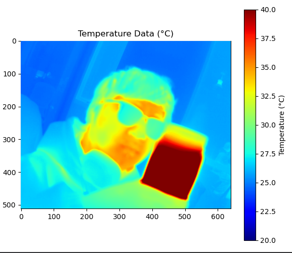

> 最近项目需要接入热成像摄像头，买的海康的热成像模组，但是这个模组没有SDK，没有windows上使用demo，只有文档，所以接入很麻烦。

## 初始尝试与踩坑

热成像摄像头使用UVC协议来读取，实际上opencv可以直接读取到画面。所以最初方案想用opencv读取，但是发现读取到数据只有画面没有热成像数据，查了一些资料没有找到opencv可以读取原始数据的方案，这种高级库可能不太适合读取底层数据。

之后尝试灰度画面和温度映射关键，我读取了温度最高的点，摄像头画面有max温度，读了几个点尝试找规律，没找到，查阅资料也没有查到海康的换算算法，但是有的热成像是可以这样转换的。遂放弃方案。

## 尝试Python与Node.js方案

项目中有node.js和python，首先考虑的是python方案，使用pyuvc库，但是读取帧的时候程序就会闪退，换了台电脑也不行，看issues，似乎也有人遇到类似的问题，但是这个库不怎么维护，遂放弃。node上也有一个类似的库，试了一下，也不行。这些库都是依托于libuvc这个库。

## libuvc底层访问

所以尝试通过libuvc来更底层的访问，libuvc虽然可以跨平台，但是实际上大多数是在linux上使用的，移植到windows上比较麻烦，我使用的一个比较丝滑的教程是这个[有关windows下libuvc的使用-CSDN博客](https://blog.csdn.net/Arom_Corge/article/details/139241033) 使用MSYS2来安装，很丝滑。安装好后面就使用C来进行通信就好了，libuvc有示例参考这来。

## 数据结构解析

数据结构如下：

```
总长度1315360字节 = 4640字节偏移 + 655360字节温度数据 + 655360字节图像数据
温度数据：640×512分辨率，每像素2字节，小端模式
图像数据：640×512分辨率，每像素2字节
```

最开始读取的时候640x512读取到的字节是655360，看起来应该是YUV数据。然后观察发现，输出的可以用的分辨率有一个640x1033，这个大小很像我的数据结构，读取试试，bingo！长度是1315360，获取成功。之后解析一下二进制数据，没问题成功获取。

## 最终解决方案

将C程序封装成DLL给Python调用，完成了整个热成像模组的接入过程。

以下是核心代码片段：

```c
#include "library.h"
#include "libuvc/libuvc.h"

#include <stdio.h>
#include <stdlib.h>
#include <string.h>
#include <time.h>

#ifdef _WIN32
#include <direct.h>  // 包含_mkdir函数
#define mkdir(dir, mode) _mkdir(dir)  // 在Windows下重定义mkdir
#else
#include <sys/stat.h>
#include <sys/types.h>
#endif

/* 定义数据结构 */
#define FRAME_OFFSET 4640
#define FRAME_WIDTH 640
#define FRAME_HEIGHT 512
#define PIXEL_SIZE 2
#define FRAME_SIZE (FRAME_WIDTH * FRAME_HEIGHT * PIXEL_SIZE)
#define TOTAL_SIZE (FRAME_OFFSET + FRAME_SIZE * 2)  // 温度数据 + 图像数据

/* 修改保存数据相关定义 */
#define SAVE_DIR "./thermal_data"

// 全局变量
static uvc_context_t *ctx = NULL;
static uvc_device_t *dev = NULL;
static uvc_device_handle_t *devh = NULL;
static uvc_stream_ctrl_t ctrl;
static int is_streaming = 0;

// 用户回调函数指针
static FrameCallback user_callback = NULL;
static void* user_data = NULL;

// 内部回调函数，将被传递给libuvc
static void internal_callback(uvc_frame_t *frame, void *ptr) {
    printf("已接收帧：序列=%u, 数据字节=%lu\n", frame->sequence, frame->data_bytes);

    // 如果用户提供了回调函数，调用它
    if (user_callback) {
        user_callback((unsigned char*)frame->data, (int)frame->data_bytes, frame->sequence);
    }
}

// 保存帧数据到文件
UVC_THERMAL_API void save_frame_to_file(const char *prefix, void *data, int size, unsigned int frame_seq) {
    char filename[256];
    char timestamp[32];
    time_t now;
    struct tm *timeinfo;

    // 创建保存目录
#ifdef _WIN32
    mkdir(SAVE_DIR, 0);
#else
    struct stat st = {0};
    if (stat(SAVE_DIR, &st) == -1) {
        mkdir(SAVE_DIR, 0755);
    }
#endif

    // 获取当前时间作为文件名
    time(&now);
    timeinfo = localtime(&now);
    strftime(timestamp, sizeof(timestamp), "%Y%m%d_%H%M%S", timeinfo);

    // 构建文件名
#ifdef _WIN32
    snprintf(filename, sizeof(filename), "%s\\frame_%s_%s_%u.raw",
             SAVE_DIR, prefix, timestamp, frame_seq);
#else
    snprintf(filename, sizeof(filename), "%s/frame_%s_%s_%u.raw",
             SAVE_DIR, prefix, timestamp, frame_seq);
#endif

    // 保存数据
    FILE *fp = fopen(filename, "wb");
    if (!fp) {
        printf("错误：无法打开文件 %s 进行写入\n", filename);
        return;
    }

    size_t written = fwrite(data, 1, size, fp);
    fclose(fp);

    if (written == size) {
        printf("已保存数据到 %s (%d 字节)\n", filename, size);
    } else {
        printf("错误：未能将所有数据写入 %s (%zu / %d 字节已写入)\n",
               filename, written, size);
    }
}

// 初始化相机
UVC_THERMAL_API int init_camera(void) {
    uvc_error_t res;

    // 如果已经初始化，先关闭
    if (ctx != NULL) {
        close_camera();
    }

    // 初始化UVC服务上下文
    res = uvc_init(&ctx, NULL);
    if (res < 0) {
        uvc_perror(res, "uvc_init");
        return res;
    }

    printf("UVC已初始化\n");

    // 定位第一个连接的UVC设备
    res = uvc_find_device(ctx, &dev, 0, 0, NULL);
    if (res < 0) {
        uvc_perror(res, "uvc_find_device");
        uvc_exit(ctx);
        ctx = NULL;
        return res;
    }

    printf("已找到设备\n");

    // 尝试打开设备
    res = uvc_open(dev, &devh);
    if (res < 0) {
        uvc_perror(res, "uvc_open");
        uvc_unref_device(dev);
        dev = NULL;
        uvc_exit(ctx);
        ctx = NULL;
        return res;
    }

    printf("设备已打开\n");
    
    // 打印设备信息
    uvc_print_diag(devh, stderr);

    return 0;
}

// 启动相机流
UVC_THERMAL_API int start_camera(FrameCallback callback, void* user_ptr) {
    uvc_error_t res;
    
    if (devh == NULL) {
        printf("错误：相机未初始化，请先调用init_camera()\n");
        return -1;
    }
    
    if (is_streaming) {
        printf("相机已经在流式传输中\n");
        return 0;
    }
    
    // 保存用户回调和数据
    user_callback = callback;
    user_data = user_ptr;
    
    // 获取格式描述符
    const uvc_format_desc_t *format_desc = uvc_get_format_descs(devh);
    enum uvc_frame_format frame_format = UVC_FRAME_FORMAT_YUYV;
    int width = 640;
    int height = 512;
    int fps = 30;
    
    // 查找对应的frame descriptor
    const uvc_frame_desc_t *frame_desc = format_desc->frame_descs;
    int found_frame = 0;
    
    // 尝试找到640x1033的帧描述符
    while (frame_desc) {
        if (frame_desc->wWidth == 640 && frame_desc->wHeight == 1033) {
            fps = 10000000 / frame_desc->dwDefaultFrameInterval;
            width = 640;
            height = 1033;
            found_frame = 1;
            printf("\n找到帧格式：%dx%d %dfps\n", width, height, fps);
            break;
        }
        frame_desc = frame_desc->next;
    }
    
    if (!found_frame) {
        // 如果没找到，使用默认的640x512
        printf("\n使用默认帧格式：640x512\n");
        width = 640;
        height = 512;
    }
    
    // 设置流控制参数
    memset(&ctrl, 0, sizeof(ctrl));
    
    // 尝试协商流参数
    res = uvc_get_stream_ctrl_format_size(
        devh, &ctrl,
        frame_format,
        width, height, fps
    );
    
    // 打印结果
    uvc_print_stream_ctrl(&ctrl, stderr);
    
    if (res < 0) {
        uvc_perror(res, "get_mode");
        
        // 尝试使用另一种方式设置流控制
        printf("\n尝试替代方法设置流控制...\n");
        
        // 手动设置流控制参数
        memset(&ctrl, 0, sizeof(ctrl));
        ctrl.bmHint = 1;
        ctrl.bFormatIndex = 1;  // YUYV格式索引
        ctrl.bFrameIndex = found_frame ? 4 : 2;  // 使用找到的帧索引或默认值
        ctrl.dwFrameInterval = 333333;  // 30 fps
        ctrl.wDelay = 0;
        ctrl.dwMaxVideoFrameSize = found_frame ? 1315360 : 655360;  // 根据帧大小设置
        ctrl.dwMaxPayloadTransferSize = 14336;
        ctrl.bInterfaceNumber = 1;
        
        // 打印手动设置的流控制参数
        printf("\n手动设置的流控制参数：\n");
        uvc_print_stream_ctrl(&ctrl, stderr);
    }
    
    printf("\n尝试格式：自定义 %dx%d 30fps (总大小：%d 字节)\n",
           FRAME_WIDTH, FRAME_HEIGHT, TOTAL_SIZE);
    
    // 开始视频流
    res = uvc_start_streaming(devh, &ctrl, internal_callback, user_data, 0);
    
    if (res < 0) {
        uvc_perror(res, "start_streaming");
        return res;
    }
    
    printf("正在流式传输...\n");
    is_streaming = 1;
    
    // 启用自动曝光
    printf("启用自动曝光...\n");
    const uint8_t UVC_AUTO_EXPOSURE_MODE_AUTO = 2;
    res = uvc_set_ae_mode(devh, UVC_AUTO_EXPOSURE_MODE_AUTO);
    if (res == UVC_SUCCESS) {
        printf(" ... 已启用自动曝光\n");
    } else if (res == UVC_ERROR_PIPE) {
        // 尝试光圈优先模式
        printf(" ... 不支持完整AE，尝试光圈优先模式\n");
        const uint8_t UVC_AUTO_EXPOSURE_MODE_APERTURE_PRIORITY = 8;
        res = uvc_set_ae_mode(devh, UVC_AUTO_EXPOSURE_MODE_APERTURE_PRIORITY);
        if (res < 0) {
            uvc_perror(res, " ... uvc_set_ae_mode无法启用光圈优先模式");
        } else {
            printf(" ... 已启用光圈优先自动曝光模式\n");
        }
    } else {
        uvc_perror(res, " ... uvc_set_ae_mode无法启用自动曝光模式");
    }
    
    return 0;
}

// 停止相机流
UVC_THERMAL_API void stop_camera(void) {
    if (devh != NULL && is_streaming) {
        uvc_stop_streaming(devh);
        is_streaming = 0;
        printf("流式传输已停止\n");
    }
}

// 关闭相机
UVC_THERMAL_API void close_camera(void) {
    // 如果正在流式传输，先停止
    if (is_streaming) {
        stop_camera();
    }
    
    // 关闭设备句柄
    if (devh != NULL) {
        uvc_close(devh);
        devh = NULL;
        printf("设备已关闭\n");
    }
    
    // 释放设备描述符
    if (dev != NULL) {
        uvc_unref_device(dev);
        dev = NULL;
    }
    
    // 关闭UVC上下文
    if (ctx != NULL) {
        uvc_exit(ctx);
        ctx = NULL;
        printf("UVC已退出\n");
    }
}

// 原始的hello函数
UVC_THERMAL_API void hello(void) {
    printf("Hello, World!\n");
}
```

最后，海康，你妈没了，浪费我一个星期。

## 参考资料

1. [libuvc GitHub仓库](https://github.com/libuvc/libuvc)
2. [有关windows下libuvc的使用-CSDN博客](https://blog.csdn.net/Arom_Corge/article/details/139241033)
3. [UVC协议规范](https://www.usb.org/document-library/video-class-v15-document-set)
